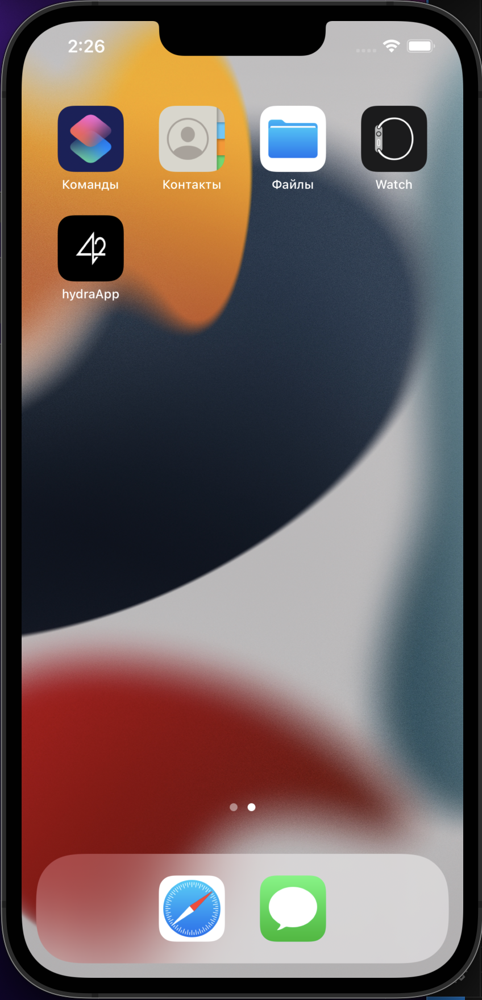
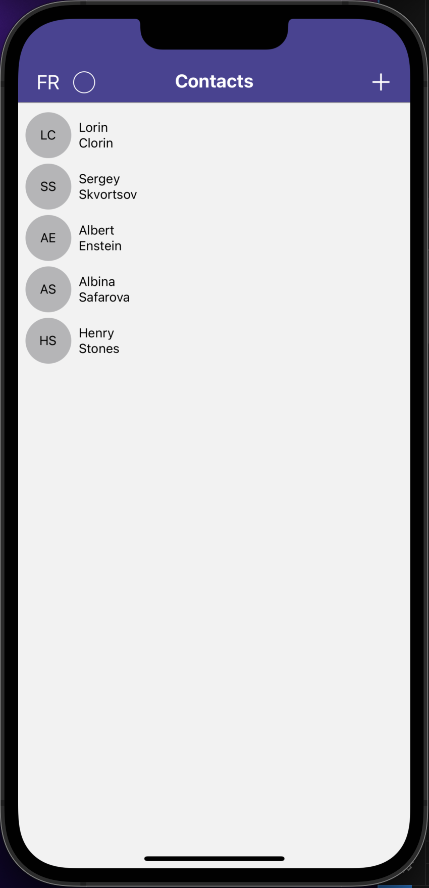
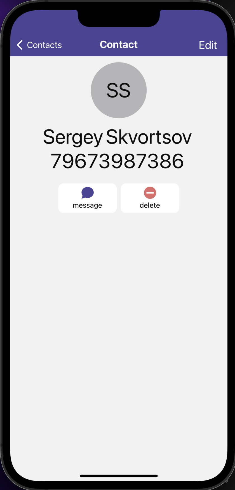
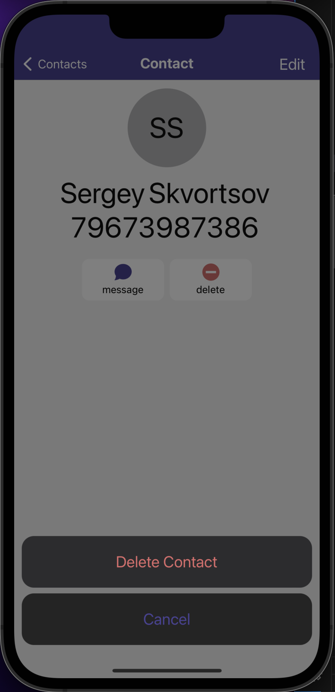
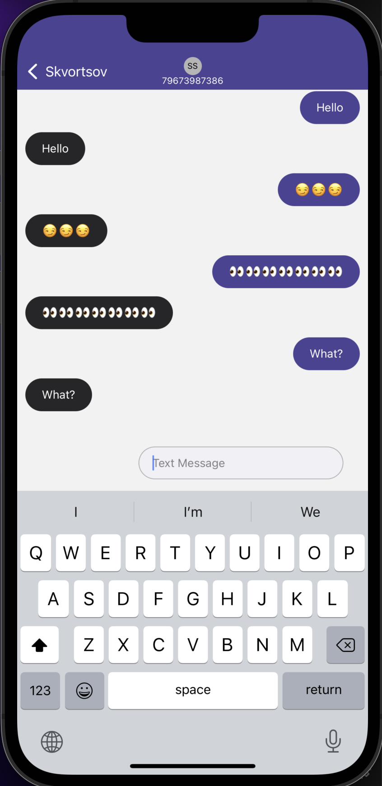

# My Contacts Application in React native

This project is written for IOS platform with local database connection. 
With it you can create contacts, delete them, edit them, write to them in chat. 
Also the application has two languages and a choice of the main color of the application


## Technologies

1. Js
2. Css (styled-components)
3. React native
4. Typescript
5. SQLLite


## Launch

1. In the main project directory, run the npm

   ```sh
   $ npm i
   ```

2. After installing the dependencies, start the project:

   ```sh
   $ npm run start
   ```

3. In the terminal, press "i" to build the project in the IOS emulator

4. In the emulator, go to the app icon and enjoy it


## Screenshots

  
  
  
  
  


  
